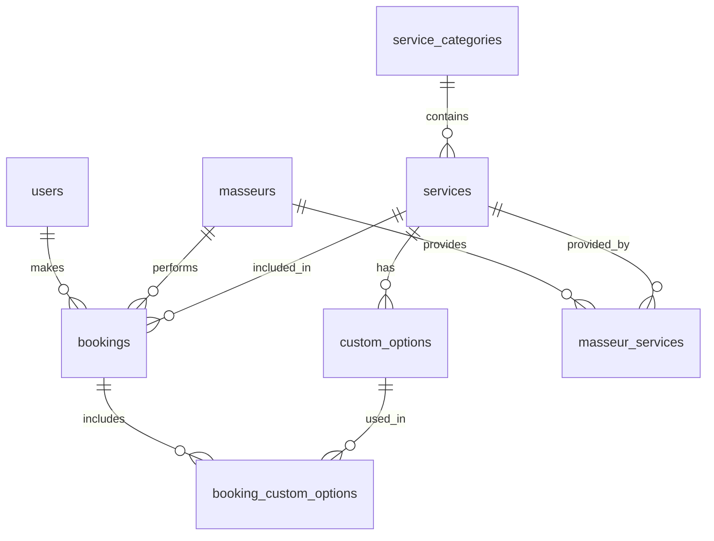

# 伊林SPA預約系統 - 資料庫設計文檔


本文件詳細說明伊林SPA預約系統的資料庫設計，包括表結構、關聯關係、索引設計等。

## 📋 目錄

- [資料庫概述](#資料庫概述)
- [表結構設計](#表結構設計)
- [關聯關係](#關聯關係)
- [索引設計](#索引設計)
- [遷移管理](#遷移管理)
- [資料備份](#資料備份)

## 💾 資料庫概述

### 技術選擇

- **資料庫**: PostgreSQL 15.0
- **託管服務**: Neon
- **ORM**: Prisma 6.2
- **連接池**: 內建連接池管理

### 設計原則

1. **正規化**
   - 遵循第三正規化形式(3NF)
   - 避免資料重複
   - 維護資料一致性

2. **效能考慮**
   - 適當的反正規化
   - 合理的索引設計
   - 查詢優化

3. **安全性**
   - 資料加密
   - 存取控制
   - 審計追蹤

## 📊 表結構設計

### 用戶相關表

#### users（用戶表）
```sql
CREATE TABLE users (
  id UUID PRIMARY KEY DEFAULT uuid_generate_v4(),
  email VARCHAR(255) NOT NULL UNIQUE,
  name VARCHAR(100) NOT NULL,
  password_hash VARCHAR(255) NOT NULL,
  role UserRole NOT NULL DEFAULT 'USER',
  phone VARCHAR(20),
  created_at TIMESTAMP WITH TIME ZONE DEFAULT CURRENT_TIMESTAMP,
  updated_at TIMESTAMP WITH TIME ZONE DEFAULT CURRENT_TIMESTAMP
);

CREATE TYPE UserRole AS ENUM ('ADMIN', 'STAFF', 'USER');
```

#### user_profiles（用戶檔案表）
```sql
CREATE TABLE user_profiles (
  id UUID PRIMARY KEY DEFAULT uuid_generate_v4(),
  user_id UUID NOT NULL REFERENCES users(id) ON DELETE CASCADE,
  avatar_url TEXT,
  gender VARCHAR(10),
  birth_date DATE,
  address TEXT,
  preferences JSONB,
  created_at TIMESTAMP WITH TIME ZONE DEFAULT CURRENT_TIMESTAMP,
  updated_at TIMESTAMP WITH TIME ZONE DEFAULT CURRENT_TIMESTAMP
);
```

### 服務相關表

#### services（服務項目表）
```sql
CREATE TABLE services (
  id UUID PRIMARY KEY DEFAULT uuid_generate_v4(),
  name VARCHAR(100) NOT NULL,
  description TEXT,
  base_price DECIMAL(10,2) NOT NULL,
  duration INTEGER NOT NULL, -- 以分鐘為單位
  category_id UUID REFERENCES service_categories(id),
  is_active BOOLEAN DEFAULT true,
  sort_order INTEGER DEFAULT 0,
  created_at TIMESTAMP WITH TIME ZONE DEFAULT CURRENT_TIMESTAMP,
  updated_at TIMESTAMP WITH TIME ZONE DEFAULT CURRENT_TIMESTAMP
);
```

#### service_categories（服務類別表）
```sql
CREATE TABLE service_categories (
  id UUID PRIMARY KEY DEFAULT uuid_generate_v4(),
  name VARCHAR(50) NOT NULL,
  description TEXT,
  sort_order INTEGER DEFAULT 0,
  created_at TIMESTAMP WITH TIME ZONE DEFAULT CURRENT_TIMESTAMP,
  updated_at TIMESTAMP WITH TIME ZONE DEFAULT CURRENT_TIMESTAMP
);
```

#### custom_options（自定義選項表）
```sql
CREATE TABLE custom_options (
  id UUID PRIMARY KEY DEFAULT uuid_generate_v4(),
  service_id UUID NOT NULL REFERENCES services(id) ON DELETE CASCADE,
  name VARCHAR(100) NOT NULL,
  price DECIMAL(10,2) NOT NULL,
  duration INTEGER NOT NULL, -- 以分鐘為單位
  is_active BOOLEAN DEFAULT true,
  sort_order INTEGER DEFAULT 0,
  created_at TIMESTAMP WITH TIME ZONE DEFAULT CURRENT_TIMESTAMP,
  updated_at TIMESTAMP WITH TIME ZONE DEFAULT CURRENT_TIMESTAMP
);
```

### 按摩師相關表

#### masseurs（按摩師表）
```sql
CREATE TABLE masseurs (
  id UUID PRIMARY KEY DEFAULT uuid_generate_v4(),
  name VARCHAR(100) NOT NULL,
  description TEXT,
  avatar_url TEXT,
  phone VARCHAR(20),
  email VARCHAR(255),
  status MasseurStatus NOT NULL DEFAULT 'ACTIVE',
  sort_order INTEGER DEFAULT 0,
  created_at TIMESTAMP WITH TIME ZONE DEFAULT CURRENT_TIMESTAMP,
  updated_at TIMESTAMP WITH TIME ZONE DEFAULT CURRENT_TIMESTAMP
);

CREATE TYPE MasseurStatus AS ENUM ('ACTIVE', 'INACTIVE', 'ON_LEAVE');
```

#### masseur_services（按摩師服務關聯表）
```sql
CREATE TABLE masseur_services (
  id UUID PRIMARY KEY DEFAULT uuid_generate_v4(),
  masseur_id UUID NOT NULL REFERENCES masseurs(id) ON DELETE CASCADE,
  service_id UUID NOT NULL REFERENCES services(id) ON DELETE CASCADE,
  price_adjustment DECIMAL(10,2) DEFAULT 0.00,
  is_active BOOLEAN DEFAULT true,
  created_at TIMESTAMP WITH TIME ZONE DEFAULT CURRENT_TIMESTAMP,
  updated_at TIMESTAMP WITH TIME ZONE DEFAULT CURRENT_TIMESTAMP,
  UNIQUE(masseur_id, service_id)
);
```

### 預約相關表

#### bookings（預約表）
```sql
CREATE TABLE bookings (
  id UUID PRIMARY KEY DEFAULT uuid_generate_v4(),
  user_id UUID NOT NULL REFERENCES users(id),
  masseur_id UUID NOT NULL REFERENCES masseurs(id),
  service_id UUID NOT NULL REFERENCES services(id),
  start_time TIMESTAMP WITH TIME ZONE NOT NULL,
  end_time TIMESTAMP WITH TIME ZONE NOT NULL,
  status BookingStatus NOT NULL DEFAULT 'PENDING',
  total_price DECIMAL(10,2) NOT NULL,
  notes TEXT,
  created_at TIMESTAMP WITH TIME ZONE DEFAULT CURRENT_TIMESTAMP,
  updated_at TIMESTAMP WITH TIME ZONE DEFAULT CURRENT_TIMESTAMP
);

CREATE TYPE BookingStatus AS ENUM (
  'PENDING',
  'CONFIRMED',
  'COMPLETED',
  'CANCELLED',
  'NO_SHOW'
);
```

#### booking_custom_options（預約自定義選項關聯表）
```sql
CREATE TABLE booking_custom_options (
  id UUID PRIMARY KEY DEFAULT uuid_generate_v4(),
  booking_id UUID NOT NULL REFERENCES bookings(id) ON DELETE CASCADE,
  custom_option_id UUID NOT NULL REFERENCES custom_options(id),
  price DECIMAL(10,2) NOT NULL,
  created_at TIMESTAMP WITH TIME ZONE DEFAULT CURRENT_TIMESTAMP,
  UNIQUE(booking_id, custom_option_id)
);
```

## 🔗 關聯關係

### 主要關聯

1. **用戶 - 預約**
   - 一對多關係
   - 用戶可以有多個預約
   - 預約必須屬於一個用戶

2. **按摩師 - 預約**
   - 一對多關係
   - 按摩師可以有多個預約
   - 預約必須指定一個按摩師

3. **服務 - 自定義選項**
   - 一對多關係
   - 服務可以有多個自定義選項
   - 自定義選項必須屬於一個服務

### 關聯圖



## 📈 索引設計

### 主要索引

1. **預約表索引**
```sql
-- 用戶預約查詢
CREATE INDEX idx_bookings_user_id ON bookings(user_id);

-- 按摩師預約查詢
CREATE INDEX idx_bookings_masseur_id ON bookings(masseur_id);

-- 時間範圍查詢
CREATE INDEX idx_bookings_start_time ON bookings(start_time);
CREATE INDEX idx_bookings_end_time ON bookings(end_time);

-- 狀態查詢
CREATE INDEX idx_bookings_status ON bookings(status);
```

2. **服務表索引**
```sql
-- 類別查詢
CREATE INDEX idx_services_category_id ON services(category_id);

-- 排序查詢
CREATE INDEX idx_services_sort_order ON services(sort_order);

-- 狀態查詢
CREATE INDEX idx_services_is_active ON services(is_active);
```

3. **按摩師表索引**
```sql
-- 狀態查詢
CREATE INDEX idx_masseurs_status ON masseurs(status);

-- 排序查詢
CREATE INDEX idx_masseurs_sort_order ON masseurs(sort_order);
```

## 🔄 遷移管理

### Prisma 遷移

1. **創建遷移**
```bash
npx prisma migrate dev --name init
```

2. **應用遷移**
```bash
npx prisma migrate deploy
```

3. **重置資料庫**
```bash
npx prisma migrate reset
```

### 遷移策略

1. **向前相容**
   - 新增欄位設置預設值
   - 先新增後刪除
   - 保持資料一致性

2. **備份策略**
   - 遷移前完整備份
   - 保留回滾腳本
   - 驗證資料完整性

## 💾 資料備份

### 自動備份

1. **定時備份**
```bash
# 每日備份腳本
pg_dump -Fc dbname > backup_$(date +%Y%m%d).dump
```

2. **備份保留策略**
   - 每日備份保留7天
   - 每週備份保留4週
   - 每月備份保留12個月

### 備份恢復

1. **完整恢復**
```bash
pg_restore -d dbname backup.dump
```

2. **選擇性恢復**
```bash
pg_restore -t tablename -d dbname backup.dump
```

## 🔒 安全性考慮

### 資料加密

1. **靜態加密**
   - 敏感資料欄位加密
   - 使用強加密算法
   - 密鑰管理策略

2. **傳輸加密**
   - SSL/TLS 連接
   - 加密備份傳輸
   - 加密管理介面

### 存取控制

1. **角色權限**
```sql
-- 創建應用角色
CREATE ROLE app_user;
CREATE ROLE app_admin;

-- 設置權限
GRANT SELECT, INSERT ON bookings TO app_user;
GRANT ALL ON ALL TABLES IN SCHEMA public TO app_admin;
```

2. **行級安全性**
```sql
-- 啟用行級安全性
ALTER TABLE bookings ENABLE ROW LEVEL SECURITY;

-- 創建策略
CREATE POLICY user_bookings ON bookings
  FOR SELECT
  TO app_user
  USING (user_id = current_user_id());
```

## 📊 效能優化

### 查詢優化

1. **常用查詢**
```sql
-- 使用者預約列表
CREATE INDEX idx_bookings_user_status ON bookings(user_id, status);

-- 按摩師排班查詢
CREATE INDEX idx_bookings_masseur_date ON bookings(masseur_id, start_time);
```

2. **分頁優化**
```sql
-- 使用 LIMIT/OFFSET
SELECT * FROM bookings
WHERE user_id = $1
ORDER BY created_at DESC
LIMIT $2 OFFSET $3;

-- 使用游標分頁
SELECT * FROM bookings
WHERE created_at < $1
ORDER BY created_at DESC
LIMIT $2;
```

### 快取策略

1. **應用層快取**
   - 服務列表快取
   - 按摩師列表快取
   - 用戶資料快取

2. **資料庫快取**
   - 配置適當的記憶體
   - 監控快取命中率
   - 定期優化快取 